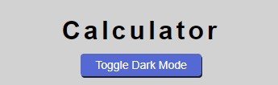
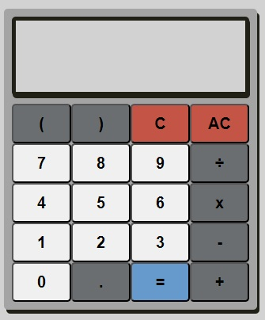

# JavaScript Calculator 

This project is designed using HTML CSS and JS to produce a fully working calculator web application. The calculator includes all standard operations as well as parentheses to separate operations. The user's inputs are displayed on the calculator screen as well as the result. Syntax errors are provided to the user through the calculator screen. A history list is provided showing the user's previous calculations performed. There is an option to clear history and put the application into dark mode. History instances can be clicked to put them back into the calculator screen. 

## Visual Features 
The web application is contained within one webpage with multiple features listed below. There is a degree of assumed knowledge that a user is able to operate a standard calculator. The design has been chosen to be simple and minimalist containing only what is necessary for a user to use the application without any further distractions. 

### Header
At the top of the web application there is a h1 element showing the name of the application, simply ‘Calculator’. The styling for this header is simplistic by design. It is there to show the user the nature of the application but not to distract from the operation itself. It is also there to aid screen readers therefore improving accessibility. 

### Dark Mode
Dark mode was added to this application for aesthetic and functional reasons. Functionally, to reduce eye strain for users particularly those using computers for extended periods of time and aesthetically for users who simply prefer the look of the calculator in dark mode. It has been set to light by default. 

### Calculator
The calculator itself is positioned below the title and dark mode toggle button. It is designed to match a normal handheld calculator, something the user will be familiar with. 

### Calculator Screen
Situated at the top of the calculator is the calculator screen. It displays the operation the user is trying to perform and the result once the equals button has been pressed. It displays each number as it is pressed by the user so they receive immediate response to their action. 

### Calculator Buttons
Below the screen 20 buttons are located containing the numbers 0-9 and all simple operands including parentheses (brackets) and decimal point. The layout of the buttons was taken from the Google Chrome calculator. The Numbers are coloured differently from the operators which are once again coloured differently from the special buttons such as clear and equals. This change is more pronounced in lightmode but more subtle in dark mode. 

### History
Beneath the calculator there is a header with the text content ‘History’ and the button that says ‘Clear History’. Once the equals button is pressed if it does not return a syntax error the operation as well as the result will be displayed below the header. The aids user experience if multiple results are required and need to be stored for a brief period. It also helps if the answer is incorrect the user can retrace their steps and identify the error. Clicking the history item will return it to the calculator for the user to complete further operations.

Pressing the clear history button simply removes all history items from the list. 

## Technical Features 
This project was designed with defensive programming at its core. The aim of which was to make the calculator probust enough anyone could use it. Below are a number of features added by the developer to improve functionality and prevent error. 

### Syntax Errors
Similarly to programming languages mathematical operations have specific syntax that it must adhere to else the operation will fail. Any operation that results in a syntax error is sent to the user via the calculator screen and the history of that operation is not sent to the history bank. 

Pressing any button will remove the syntax error message and allow further use of the calculator. 

### First Instance Operators 
The user is prevented from entering multiply, divide, subtract, add or decimal point as the first item on the calculator screen. As no mathematical operation can start with these operators. It is however possible to start an operation with the minus operator when it is used to denote a negative number. Therefore, the minus operator is permitted to be inputted first but only one instance is permitted as the next item must be a number value. 

### Multiple Instance Operators
Multiple operators are not permitted following each other for example 6 x x 7. After each operator there is an expectation for a number value. Once again this is not the case for the minus operator where it is acceptable to query 6 x -7. But 6 x --7, is prohibited. 

### Clearing
The ‘C’ button is used to clear the most recent entry into the calculator and ‘AC’ is used to clear all. This pattern persists unless syntax error is displayed in the calculator in which case pressing C AC or any number button will remove the whole message. 

### Calculator Full
An alert is provided to the user when the calculator is full and can no longer accept further inputs from the user. Advice is passed to the user requesting that they clear the whole display using AC or clear one item using C. 

### Post Deployment alterations 
Following the deployment of this site various changes have been identified and rectified to improve user experience. 

Remove Space From End of History Item 
It was noticed that when clicking a history item to put it back onto the calculator screen there was white space before entering the next number or operator. Whilst this did not affect the evaluation of the sum it did not appear aesthetically pleasing, this white space was removed. 

### Remove Infinity 
When dividing a positive number by 0 ‘Infinity’ will be returned, when dividing a negative number by 0 ‘-Infinity’ will be returned. This has been exchanged for a response produced by an actual calculator which is ‘Math Error’

### Remove Undefined
When pressing equals with no operation the result undefined would be provided to the user. Naturally this would also populate the history area. This was removed such that pressing the equals key with no input would produce no results. 

### Prevent close parentheses first
When attempting to press the close parenthesis button a function called canClose() is called that checks that at least one opening parentheses is within the operation. If it is not the button will not work and there will be close parenthesis added to the display. 

### Remove NaN
It was noticed after deployment that if the user queried 0/0 the result from eval() would be NaN (Not a Number). The developer has removed this in exchange for a more user friendly response of Math Error provided to the user. 

### Prevent No Operation 
Without this the user was able to press any number and the equals. This would produce a history entry of 3 = 3 or 4 = 4 or whatever number the user input. Whilst mathematically true there is no requirement for this to enter the history. It has therefore been removed. No pressing any number and then the equals will not alter the history nor will it produce an error. The number entered will simply remain. 

## Validator testing 

### JavaScript testing
Performed using jshint.com. Revealing no critical errors. The metrics are as follows: 
There are 37 functions in this file.
Function with the largest signature take 2 arguments, while the median is 0.
Largest function has 27 statements in it, while the median is 1.
The most complex function has a cyclomatic complexity value of 13 while the median is 1.
JShint produced 5 warnings, 4 of which pertain to ES6. The fifth stating that eval can be harmful. This is a warning and not an error. Eval has been used appropriately and provisions have been put in place to prevent error. Errors that persist which are due to the user are caught and passed to the user using the calculator screen. 

### HTML testing
Performed using validator.w3.org/. Revealing no errors of any sort. 

### CSS testing 
Performed using jigsaw.w3.org/css-validator/ revealing no errors of any sort.

### Lighthouse
Lighthouse testing was also performed.

## Deployment 
Deployment was done via GitHub. Testing was performed on the deployed site to ensure that the CSS and JS files were connected showing the right file path.

The application was deployed to GitHub pages from the code and automation tab within teh settings of the repository. It was deployed from the main branch. 

Testing using IOS was done to ensure functionality on Apple devices. Due to the lack of a defined color of the calculator integers they were displayed in blue by ISO (Safari) as default. This was rectified by providing a color in the CSS file for the buttons. 

The alert was also tested on iPhone which produced a positive result. 

## Eval Function
The eval() function was used to perform the actual calculation following the user's input. It takes a string and performs the desired operation if it can. If it is unable to, an error will be given. The eval function has proven very important in this project as it is able to perform calculations on strings obtained from the DOM. 

However, there were certain provisions necessary to put in place in order for eval to work effectively. Firstly, x and ÷ were chosen instead of * and / This was to improve the visual aesthetic of the calculator and it is what users of calculators are more used to seeing. This needed to be changed before performing the eval function. 

Catching errors was the next priority. Eval works in a programmatic way. It not only produces syntax errors but also undefined, Infinity, -Infinity, and NaN. Whilst these concepts are known to programmers they mean very little to most using a calculator particularly undefined and NaN. These errors have been accounted for producing Math Errors when impossible operations are performed such as 5÷0 or 0÷0.

## Final Changes 
In the later stages of development a scroll to top button has been added which allows the user to press the button and scroll back to the very top of the page this is useful when a large number of history items have been added. 

The scroll to top button is located in the center of the screen and at the bottom. It is positioned relative and is pushed down by new history elements. It has a default display of none as there is no need to scroll when the page is first loaded. After 4 entries into the history area the scroll to top button is displayed. It is once again removed when the history is cleared. 

## References 
Layout of the calculator was taken from the Google Chrome browser calculator. 
https://www.google.com/search?q=calculator&rlz=1C1FKPE_en-GBGB931GB931&oq=calculator&gs_lcrp=EgZjaHJvbWUqDggAEEUYJxg7GIAEGIoFMg4IABBFGCcYOxiABBiKBTIKCAEQABixAxiABDIKCAIQABixAxiABDIKCAMQABixAxiABDIKCAQQABixAxiABDIGCAUQRRg8MgYIBhBFGDwyBggHEEUYPKgCCLACAQ&sourceid=chrome&ie=UTF-8

scroll to top button. 
https://www.w3schools.com/howto/howto_js_scroll_to_top.asp